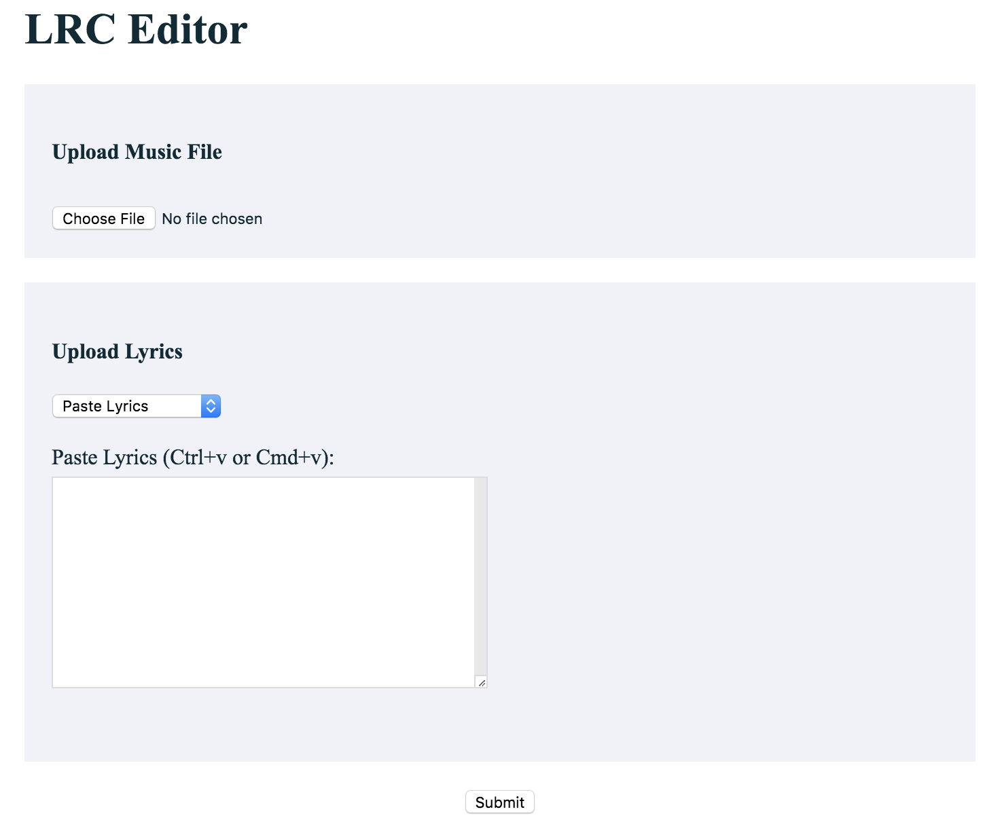
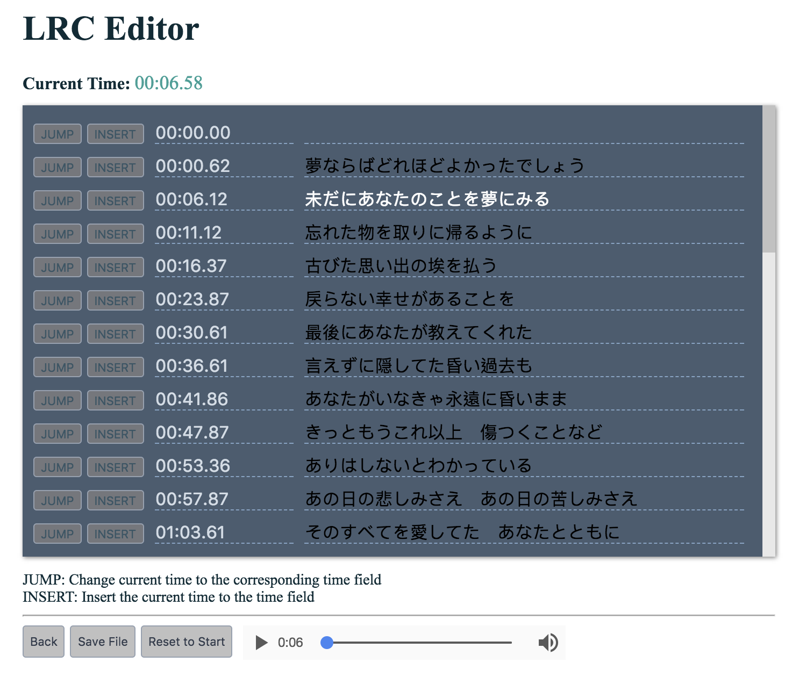

# LRC Editor

A simple program to help people to synchronize their lyrics with songs(.lrc). The program provide convenience to edit and test Karaoke lyrics.

This is a desktop application written with pure javascript using ElectronJS.

To run the program on local:
- git clone the repository
- go to root folder, run `npm install` to install dependencies
- run `npm start` to start the program

### Upload Song and Lyrics

### Edit and Test Lyrics
